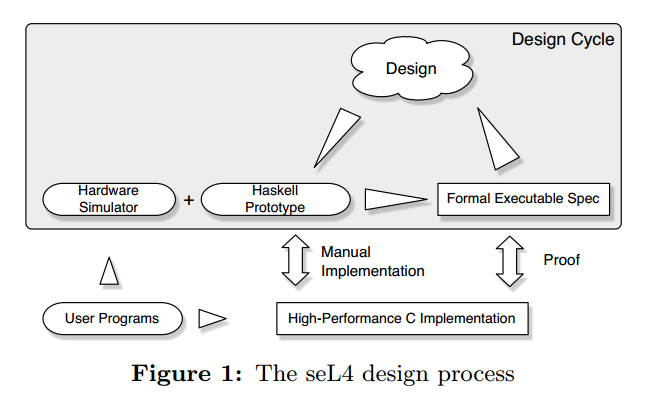

## seL4: Formal Verification of an OS Kernel

完整的形式化验证是确保系统没有编程错误的唯一已知方式。

文章展示了从抽象规范到C语言实现方面对seL4微内核进行正式的机器检查验证的过程。假如编译器、汇编代码和硬件的正确性,使用了一种独特的设计方法来融合形式化和操作系统技术,这是第一个完整的对通用操作系统内核的功能正确性的形式化验证。功能正确性意味着实现始终遵循对内核行为的高级抽象规范,包括传统的设计和实现完全属性,如内核永远不会崩溃,永远不会执行不安全的操作。还证明了：可以精确预测内核在每一种可能情况下的行为。

计算机系统的安全性和可靠性最多和底层操作系统内核一样好。内核以处理器最高特权模式执行，具有无限的对硬件访问权限。因此,内核实现的任何错误都有可能破坏系统其余部分的正确运行。

当安全性或可靠性至关重要时,通常的方法是减少特权代码的数量,以最大限度减少漏洞的暴露。这是安全内核和分离内核、MILS方法、微内核和隔离内核的主要动机。使用小型虚拟机管理程序作为最小的信任基础。以及除了一些dirty core，所有代码使用类型安全语言。使用真正的小内核,可以进一步保证安全性和鲁棒性，直到可以保证没有错误的程度。这可以通过形式化、机械检查的验证来实现，提供数学证明,内核实现与其规范一致，并且没有程序员引发的实现缺陷。

提出了seL4，旨在通过机器和机器检查的形式化证明来提供功能正确性的保证。

seL4实现了以下部分:

* 适用于现实使用,并能够实现与最佳性能微型芯片相当的性能。
* 其行为在抽象层面正式规定。
* 形式化设计用于证明所需属性。包括终止和执行安全。
* 访问控制机制被形式化证明可以提供强大的安全保障。

## Summary of major innovations(重大创新)

#### seL4 编程模型

seL4是第一个完全形式化验证功能正确性的通用操作系统内核。因此,这是一个前所未有的可信赖的平台,可以建立高度安全可靠的系统。不仅分析内核的特定方面,例如安全执行,还可以为内核的精确行为提供完整的规范和证明。创建了一种快速内核设计和实现的方法。是传统操作系统和形式化方法技术的融合。

它具有虚拟地址空间,线程，进程间通信(IPC)的抽象,虚拟地址空间没有内核定义的结构,页错误通过IPC传输到页线程(负责通过将帧映射到虚拟空间来定义地址空间)。异常和非本地调用也通过IPC传播以支持虚拟化。IPC使用同步和异步终端(端口式不进行内核缓冲目的地)进行线程间通信,RPC通过回复(reply)功能进行协助,capabilities被隔离并存储在被称为CNodes的capability容器对象组成的capability地址空间中。

seL4设备驱动程序作为正常的用户模式应用程序运行,通过将设备映射到虚拟地址空间,或通过受控访问Intel x86硬件上的设备端口,可以访问设备寄存器和内存。seL4提供接收中断通知的机制(IPC)并确认其接收。

seL4内存管理是明确的：内核对象和虚拟地址空间都是通过capalities进行保护和管理的。物理内存最初由无类型的capabilities表示,可以将其细分或重新分类为内核对象,如页表,线程控制块,CNode,终端和帧(用于虚拟地址空间中的映射),该模型保证内核中的所有内存分配都是明确授权的。

#### 内核设计过程

OS开发人员倾向于采用自下而上的内核设计方法。通过有效管理硬件可以获得高性能,设计依赖于底层细节,从业者倾向于自上而下的设计,因为证明可追溯性是由系统复杂性决定的。导致基于硬件抽象程度高的简单模型的设计。seL4采用了一种基于中间目标的方法。使用Haskell为编程语言,同时可以自动转换为定理证明工具和推理的人工制品。

双箭头表示实现或证明effort

单箭头表示artefacts实现/设计对其他artefacts的影响。

中心是内核Haskell原型。

提供了一个原型设计环境，为了从用户和内核两个角度进行low-level设计评估，包括物理和虚拟内存管理，还提供了与真实内核二进制兼容的现实执行环境。我们将自己限制在可以自动翻译成使用的定理证明语言Haskell自己种。虽然Haskell原型是最终设计的可执行模型和实现,但并不是最终的生产内核。用C语言重新实现模型原因：

* Haskell运行时是一个重量级代码(比内核大很多),难以验证正确性。
* Haskell运行时依赖不适合实时环境的垃圾回收。
* 使用C可以优化性能实现。

#### 形式化验证

用于形式化验证的技术是交互式、机器辅助和机器检查证明。使用Isabelle/HOL.互动定理证明需要人为干预和创造力来构建和指导证据。优点在于不限于特定属性或有限的可行状态空间,而不像更多的自动化验证方法：如静态分析或模型检查。意义在于功能正确性的证明。

通过细化证明建立的对应确保抽象模型的所有Hoare逻辑属性也适用于精炼模型。这意味着在Hoare逻辑中证明了一个安全性属性,那么关于抽象模型(并非所有的安全属性都可以)则细化保证内核源代码具有相同的属性。

验证永远不会是绝对的，它总是必须做出根本的假设。停止在代码级别,意味着至少假设编译器和硬件是正确的。

使用两种具体的技术：

* 从第一原则出发,数学、语义和Hoare逻辑不是公理化的,而是被定义和证明。
* 使用Isabelle定理证明器可以产生外部证明表示,可以通过一个简单的小型检验器进行独立检查。

### **Kernel Design for Verification**

正确性证明的主体可以被认为是在程序语句和每个规范级别的功能上显示Hoare三元组。细化和Hoare逻辑框架中的证明沿着函数边界分解。每个证明单元都有一组前提条件,需要在执行前保留,修改系统状态的函数中的语句或语句序列以及之后必须保留的后续条件，显示前后条件的困难程度与声明的复杂性,声明可以修改的状态以及条件前后的属性的复杂性直接相关。

为了验证内核是否可行，其设计应尽可能减少这些组件的复杂性。理想情况下,内核代码(或相关证明)将由简单的语句构成,这些简单语句依赖于显示的本地状态，具有简单的不变量。然后,这些较小的元素可以抽象的组成更大的元素，以避免暴露潜在的local元素。不幸的是,操作系统内核通常不是这样构造的,通常具有高度相互依赖的子系统。

## What the problems the paper mentioned?(提到的问题)。

## How about the important related works/papers?

## What are some intriguing aspects of the paper?

## How to test/compare/analyze the results?

